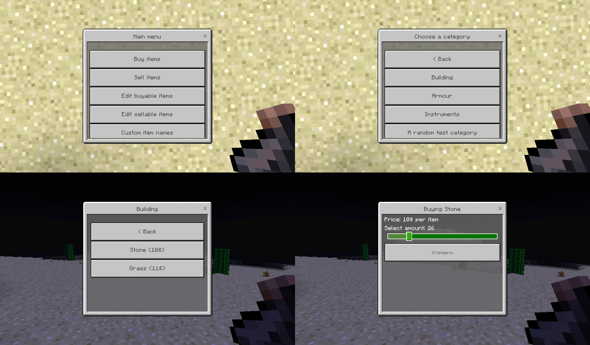

# Trading Interface

Shop system with a graphical interface for [NukkitX][nukkitx] server software for Minecraft Bedrock Edition!

## Features:
-   Buying and selling items & shop management through an intuitive interface;
-   The list of items, available for buying, is divided into categories for convenience;
-   Discounts for items;
-   Custom names for items.

## Installation:
-   Make sure that [EconomyAPI][economy] and [DbLib][dblib] are installed on your server;
-   Place the plugin's _.jar_ file into _plugins_ folder on your server;
-   Launch the server and set up the plugin through its interface.

## Migrating from [Trading Commands](https://github.com/Leonidius20/TradingCommands):
Trading Interface supports the _Trading Commands_' configuration files' format. Just copy _buyList.yml_ and _sellList.yml_ from _plugins/Trading_Commands_ folder to _plugins/Trading_Interface_.

## Setting up:
Shop management functions are available for players with `shop.edit` permission (operators have it by default). Players with this permission will see management buttons in the interface.

## Usage:
To open up the shop's interface type `/shop` into the chat.

## Translations
If the plugin is not translated into the language of your choosing, a file called `<your_lang>.lng`, where `<your_lang>` is the three-letter ID of your language, will be created in the plugin's data folder. It will contain text strings in the format of `key: value`, where `key` is the string's identifier and `value` is the string itself. Replace values in English with the values in your language, and these new strings will be used by the plugin. You can also start a pull request, placing `<your_lang>.lng` into `src/main/resources/lang`, and your translation may officially become a part of the plugin.

## Links
-   [Trading Interface on nukkitx.com](https://nukkitx.com/resources/trading-interface.113/)
-   [Trading Interface on nukkit.ru](http://forums.voxelwind.com/resources/trading-interface.144/)

[economy]: https://github.com/EconomyS/EconomyAPI
[dblib]: https://github.com/fromgate/DbLib
[nukkitx]: http://github.com/NukkitX/Nukkit
